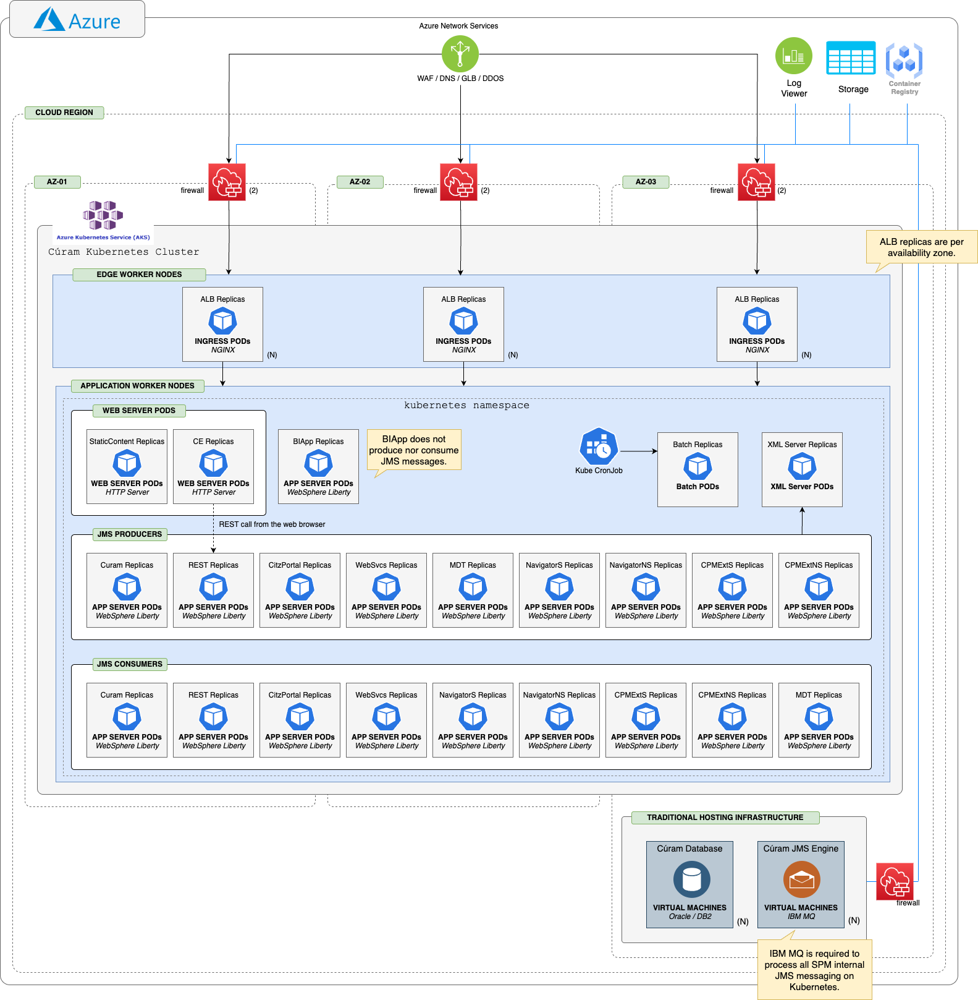

## Cúram Azure Kubernetes Service Cluster - Reference Architecture

This section provides an overview of the recommended deployment architecture for Cúram on Azure Kubernetes Service (AKS). The architecture is designed to maximize flexibility, elasticity, efficiency, and the strategic benefits of cloud-native platforms.

<InlineNotification kind="info">
  

    

      • <strong>Azure Kubernetes Service (AKS)</strong> is supported for <strong>Development</strong> and <strong>Test</strong> environments for both <strong>Java 8</strong> and <strong>Java 21</strong>.
    

    

      • <strong>Azure Kubernetes Service (AKS)</strong> is supported for <strong>Production</strong> use with <strong>Java 21</strong> only.
    

  

</InlineNotification>

<Caption>
*Figure 1:* Cúram on Kubernetes - Deployment Architecture
</Caption>

- Cúram is deployed on WebSphere Liberty, a lightweight Java EE application server designed for cloud-native platforms.
- Each Cúram EAR file is deployed in a dedicated Liberty instance, enabling independent scaling and fault isolation.
- Liberty instances are built using Cúram-provided Dockerfiles and deployed as containers within Kubernetes pods.
- Batch and XML Server components are also packaged as Docker images and deployed as containers, with resource requirements defined per workload.
- The database tier must be deployed on bare metal or virtual machines; managed cloud database services are not officially supported unless explicitly documented.
- JMS messaging is provided by IBM MQ, which is deployed and managed outside the Kubernetes cluster (on a VM) using Helm charts.
  - Only IBM MQ Long Term Support (LTS) releases are supported for deployment on bare metal and VMs to ensure stability and vendor support.
- To minimize latency and maximize performance, deploy the database and queue manager tiers in the same network zone or region as the application tier.
