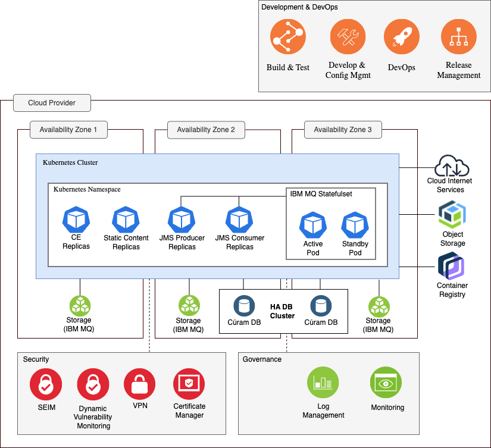
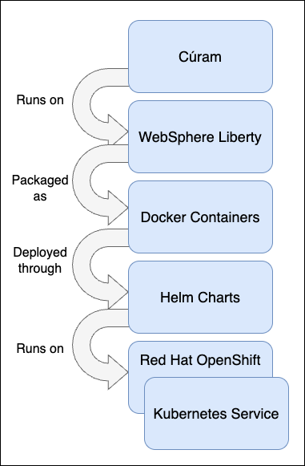

Cúram is not offered as a Platform-as-a-Service (PaaS) or Software-as-a-Service (SaaS) solution in the cloud. Instead, it is a configurable platform for Social Program Management that customers tailor to meet their specific requirements. Customers are responsible for building, deploying, running, and operating Cúram in environments aligned with their own Software Development Life Cycle (SDLC) processes.

Cúram can either be deployed on traditional hosting architectures (i.e. virtual machines or bare metal) or on Kubernetes. This runbook focuses exclusively on cloud-native hosting on Kubernetes.

Cúram can be deployed on the following distributions:

1. **Azure Kubernetes Services (AKS)**
2. **Amazon Elastic Kubernetes Service (EKS)**

  <InlineNotification kind="warning">

  **Note:** EKS is intended for Development and Test purposes only.

  </InlineNotification>

3. **Red Hat OpenShift\***

\*OpenShift deployments are environment-agnostic and can be run on any infrastructure that supports OpenShift, including **on-premises**, **private cloud**, or **public cloud** environments.

Figure 1 shows the essential nature of the Cúram architecture on Kubernetes.

It conveys the governing ideas and major building blocks of the architecture.
The **"Development & DevOps"**, **"Security"**, and **"Governance"** components and processes described in the architecture diagram are just for reference. They will likely be different depending on your Deployment Architecture.

Cúram does not require nor impose these components in the architecture.

<InlineNotification>

**Note:** This runbook does not provide any content or guidance on the `Development and DevOps`, `Governance` or `Security`.

</InlineNotification>

<Caption>

*Figure 1:* Cúram on Kubernetes

</Caption>

Figure 2 shows how Cúram is built as a containerized application by using WebSphere® Application Server Liberty, packaged as Docker®
containers, orchestrated by Helm, and running on Red Hat OpenShift or Kubernetes Service.

<Caption>

*Figure 2:* Cúram packaging for Kubernetes

</Caption>

<InlineNotification>
**Note:** Database support remains on virtual machines (VMs) as the current deployment model.
</InlineNotification>

To support containerized architectures, a number of architectural changes were made. The changes are documented as follows and apply only to Cúram running on
Kubernetes.

* **Message Architecture**
  When Cúram is containerized, IBM MQ Long Term Support (LTS) is used as the message engine to process internal application
  JMS-based deferred processing.
* **Transaction Isolation**
  Client HTTP initiated transactions and JMS initiated transactions run on different WebSphere Application Server Liberty instances, integrated through
  an external message engine (for example, IBM MQ).
* **Elasticity**
  Elasticity in Kubernetes Service is the ability to scale up or down pods and nodes to adjust to the load to meet the end user demand.

For more information about Cúram Kubernetes architecture changes, see **Kubernetes architecture** in the *Cúram on Kubernetes Guide*.

<InlineNotification>

Cúram PDF documentation, including guides on deployment, configuration, and troubleshooting, is available to download from [Cúram Support Docs](https://curam-spm-devops.github.io/wh-support-docs/spm/pdf-documentation/).

</InlineNotification>
