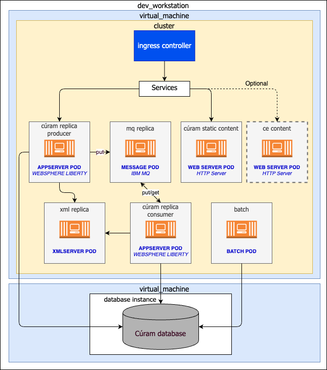
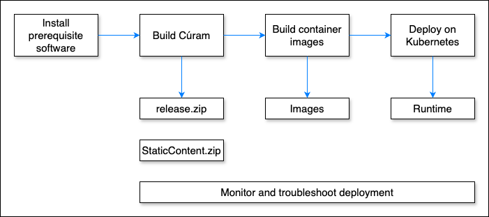

This runbook is intended for first-time users of Helm, Minikube, and Kubernetes who want to deploy Cúram in a local development environment.

Minikube is a lightweight Kubernetes implementation that runs a single-node cluster inside a virtual machine (VM) on your laptop. This setup provides a minimal architecture to help you become familiar with the main artifacts needed to run Cúram on Kubernetes.

### Development Workstation Architecture

Figure 1 shows the example architecture:

<Caption>
*Figure 1:* Example dev workstation architecture
</Caption>

The architecture consists of a Kubernetes environment (within a VM) containing the following components:

- An IBM® WebSphere® Liberty-based pod that contains the Cúram EAR file.
- A pod with an IBM MQ Server configured as the message engine to support JMS-based deferred processing in Cúram.
- A pod that contains the XML server.
- A pod that runs batch processes.

This environment connects to an external IBM Db2 or Oracle database.

For a Kubernetes cluster in a development environment this runbook uses [Minikube](/prereq/kubernetes/minikube).
Minikube can easily run on a developer computer, which is convenient for describing the application flow.
[CodeReady Containers](/prereq/openshift/codeready-containers) (CRC) can also be used to run a Kubernetes environment in a development environment.

### Development Workflow

Figure 2 outlines the development workflow:

- Create a build and deployment environment for Cúram.
- Build Cúram for deployment on Kubernetes using Minikube or CRC.
- Create Docker® images for Cúram.
- Deploy Cúram Docker images to Kubernetes on Minikube or CRC.
- Troubleshoot Cúram when deployed in Kubernetes.

<Caption>
*Figure 2:* Process summary
</Caption>

<InlineNotification>
**Note:** The implementation of Cúram that is described in this runbook uses only the following .ear files:
- Curam.ear
- CuramServerCode.ear

The scripts can be easily extended to include the other Cúram applications, such as Rest or Citizen Portal.
</InlineNotification>

The runbook makes the following assumptions:

- Steps to build the Cúram containers and run Minikube or CRC are performed on a Red Hat or macOS development machine.
- Steps related to [Building the Cúram application](/deploy-curam/build-curam) can be executed on a separate machine.
- You have basic knowledge of the Linux command line for navigating folders.
