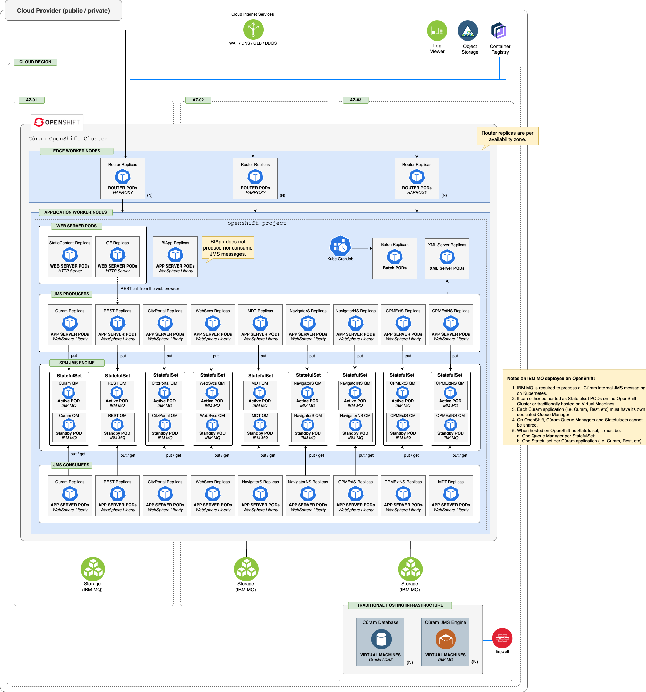

## Cúram OpenShift Cluster - Reference Architecture

The reference architecture in this section represents how Cúram should be deployed into OpenShift.
This architecture allows Cúram to leverage the benefits of flexibility, elasticity, efficiency and the strategic value offered by cloud native architecture.

<InlineNotification kind="info">
  

    

      • <strong>OpenShift</strong> is supported for <strong>Development</strong>, <strong>Test</strong> and <strong>Production</strong> environments for both <strong>Java 8</strong> and <strong>Java 21</strong>.
    

  

</InlineNotification>

<Caption>

*Figure 1:* Cúram on OpenShift - deployment architecture

</Caption>

- Cúram is deployed on WebSphere Liberty, a lightweight Java EE application server designed for cloud-native platforms.
- Each Cúram EAR file is deployed in a dedicated Liberty instance, enabling independent scaling and fault isolation.
- Liberty instances are built using Cúram-provided Dockerfiles and deployed as containers within OpenShift pods.
- Batch and XML Server components are also packaged as Docker images and deployed as containers, with resource requirements defined per workload.
- The database tier must be deployed on bare metal or virtual machines; managed cloud database services are not officially supported unless explicitly documented.
- JMS messaging is provided by IBM MQ, which can be deployed and managed either outside the OpenShift cluster (on a VM) or as a container within OpenShift, using Helm charts.
- Cúram supports both IBM MQ Long Term Support (LTS) and Continuous Delivery (CD) releases, with the following limitations:
  - IBM MQ LTS is only supported for deployment on bare metal and VMs.
  - IBM MQ CD is only supported for deployment as containers within OpenShift.
- To minimize latency and maximize performance, deploy the database and queue manager tiers in the same network zone or region as the application tier.
