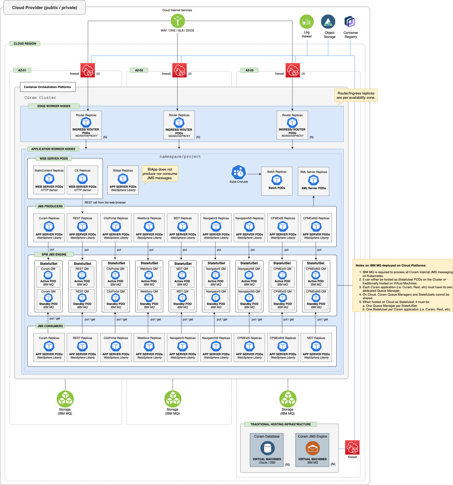

## Cúram - Reference Architecture

The reference architecture in this section represents how Cúram should be deployed into a Container Orchestration Platform.
This architecture allows Cúram to leverage the benefits of flexibility, elasticity, efficiency and the strategic value offered by cloud native architecture.

<Caption>

*Figure 1:* Cúram - deployment reference architecture

</Caption>

- Cúram is deployed on WebSphere Liberty, a lightweight Java EE application server designed for cloud-native platforms.
- Each Cúram EAR file is deployed in a dedicated Liberty instance, enabling independent scaling and fault isolation.
- Liberty instances are built using Cúram-provided Dockerfiles and deployed as containers within OpenShift/Kubernetes pods.
- Batch and XML Server components are also packaged as Docker images and deployed as containers, with resource requirements defined per workload.
- The database tier must be deployed on bare metal or virtual machines; managed cloud database services are not officially supported unless explicitly documented.
- JMS messaging is provided by IBM MQ, which can be deployed and managed either outside the cluster (on a VM) or as a container within the cluster using Helm charts.
- Cúram supports both IBM MQ Long Term Support (LTS) and Continuous Delivery (CD) releases, with the following limitations:
  - IBM MQ LTS is only supported for deployment on bare metal and VMs.
  - IBM MQ CD is only supported for deployment as container on OpenShift and Kubernetes.
- To minimize latency and maximize performance, deploy the database and queue manager tiers in the same network zone or region as the application tier.
