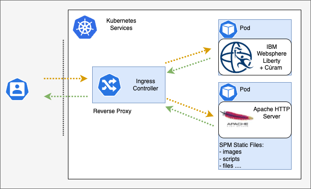

## Deploy Cúram Static Content in Azure Kubernetes Services (AKS)

The static content server feature allows static content to be hosted on a separate web server. This enables the web server to be optimized specifically for serving static content, reducing the load on the main Cúram application servers.

<InlineNotification>
**Note:** For more information about Cúram static content, see **Static Content Server** in the *Cúram Web Client Reference Manual*.
</InlineNotification>

<Caption>

*Figure 1:* Cúram on Kubernetes - static content

</Caption>

As shown in Figure 1, Cúram static content runs in its own pod. By isolating static content in a dedicated pod, you can take advantage of the flexibility, elasticity, and efficiency offered by cloud-native architecture.

Serving static content is a fundamental part of the application. Therefore, static content should be served from a pod running on the application worker nodes.

While it is technically possible to serve Cúram static content from ingress controllers (such as ALBs), this is not recommended. Ingress controllers are not designed to serve static content. Application workloads should be isolated from ingress workloads. The ingress controller should be dedicated to handling ingress rules for the cluster and treated as part of the infrastructure layer of the cloud-native architecture.

<InlineNotification>
**Note:** For more infomation about how to create an Cúram static content container to run on Kubernetes, see [Building the Docker® images](/build-images/build_images)
</InlineNotification>
